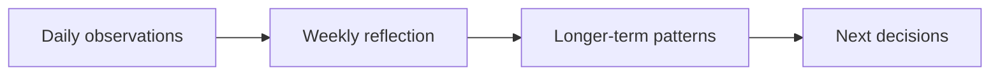

# Trajectory

Trajectory is a local-first reflection and personal analytics product. It helps people turn short daily observations into careful weekly and longer-term decisions without treating correlation as causation.


**Vue 3 · TypeScript · Pinia · Dexie · ECharts · PWA**

The core flow stays intentionally small: record what mattered today, review a completed week, inspect longer-term patterns, and choose a useful next step. Every field is optional, and incomplete data remains visible rather than being filled with assumptions.

## Why Trajectory

Daily notes are easy to collect and hard to interpret. Trajectory connects observations to periodic reflection while preserving the difference between missing data, unusual days, and ordinary patterns. Comparisons expose their sample sizes and avoid presenting associations as proven causes.



## How it works

- **Today:** capture sleep, energy, context, actions, life areas, and one factual note without requiring every field.
- **Week:** combine coverage, noteworthy observations, completed outcomes, special days, and one next decision.
- **Trends:** inspect longer-term change, monthly metrics, and equal-window comparisons around important events.

## Engineering highlights

- **Local-first persistence.** Pinia coordinates application state while Dexie persists user edits in IndexedDB across reloads.
- **Explicit boundaries.** Domain normalization, application orchestration, Vue presentation, analytics, and persistence have separate responsibilities enforced by import rules.
- **Analytics before visualization.** Pure calculation modules produce summaries and comparisons; Vue and ECharts render the results independently.
- **Honest data semantics.** Calculations preserve missing values, sample sizes, incomplete periods, and special-day exclusions.
- **Responsive PWA behavior.** The shell provides route-level code splitting, service-worker updates, offline-capable local data, and stale-chunk recovery.
- **Reproducible test data.** The application, unit tests, browser tests, and screenshots share one deterministic synthetic-data generator.

## Product walkthrough

### Today

The mobile-first entry keeps the current week visible while allowing the user to record only the observations that matter that day.

<p align="center">
  
</p>

### Week

The weekly view combines data coverage, cautious review cues, completed outcomes, important context, and the next-decision workflow.


### Trends

Longer-term views place observation counts and interpretation boundaries alongside calculated trends.


## Architecture

```text
Vue views and components
          ↓
Application features
          ↓
Domain model and analytics
          ↓
Dexie local persistence
```

See [the architecture overview](docs/architecture.md) for module responsibilities and the public repository boundary.

## Explore the code

- [Domain normalization](src/model/normalization.ts) preserves compatibility and the meaning of missing values.
- [Analytics modules](src/features/analytics) keep calculations independent from presentation.
- [Dexie schema](src/db.ts) and [application store](src/stores/app.ts) show the local persistence boundary.
- [Daily-entry feature](src/features/daily-entry) contains the application flow for short daily observations.
- [Demo bootstrap](src/demo/bootstrap.ts) and [data generator](scripts/generate-demo-data.mjs) provide a reproducible, validated baseline.

## Local data and reset

On first launch, an empty IndexedDB database receives a validated synthetic snapshot. Later edits remain local, and **Сбросить демо-данные** restores the reproducible baseline. No credentials, backend, or account are required.

## Testing

The focused suite covers domain and daily-entry behavior, analytics semantics, versioned import, data generation and bootstrap, a representative Vue surface, local persistence, and navigation to analytics.

```powershell
npm.cmd run lint
npm.cmd test
npm.cmd run build
npm.cmd run test:e2e
```

## Run locally

Requirements: Node.js 22 and npm.

```powershell
npm.cmd ci
npm.cmd run dev
```

The synthetic data asset is generated automatically before development, production builds, and Playwright runs.

## Public and production editions

This repository contains the public, local-first edition of Trajectory. Production authentication, cloud synchronization, backend infrastructure, private data, internal documentation, and private development history are intentionally kept outside this repository.
