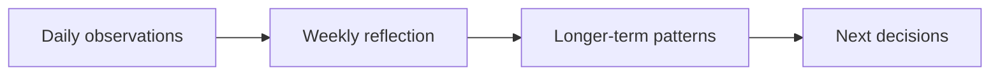
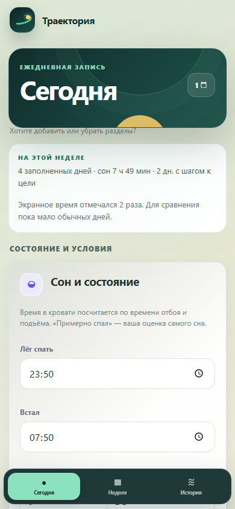
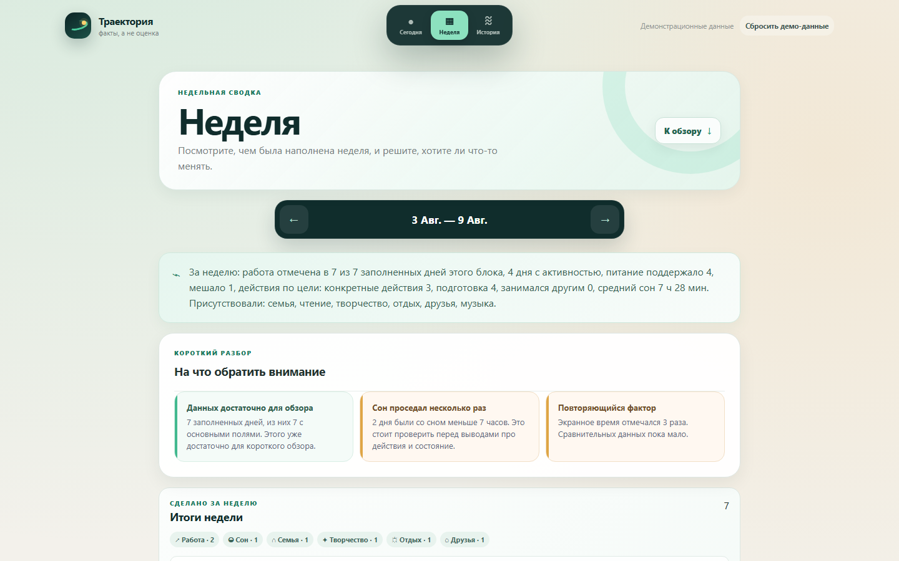
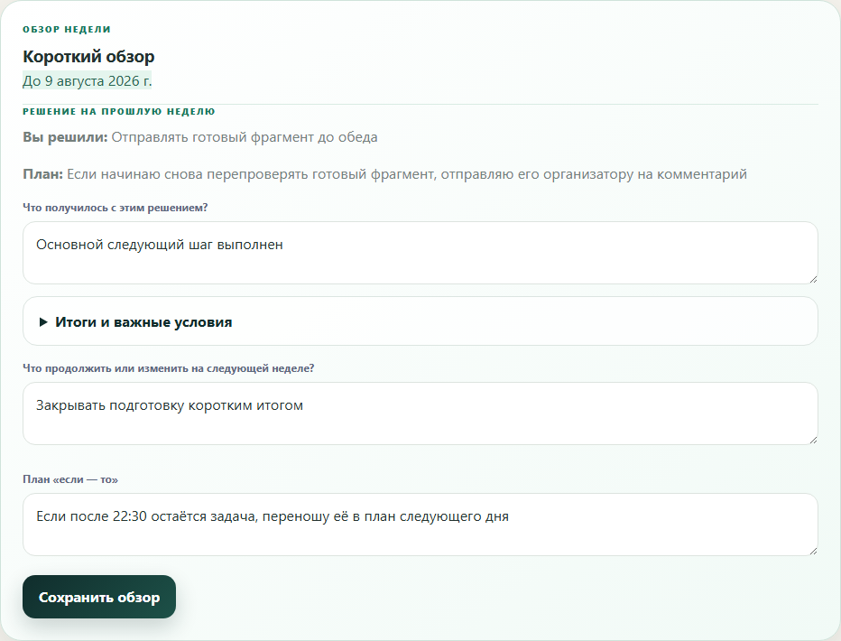
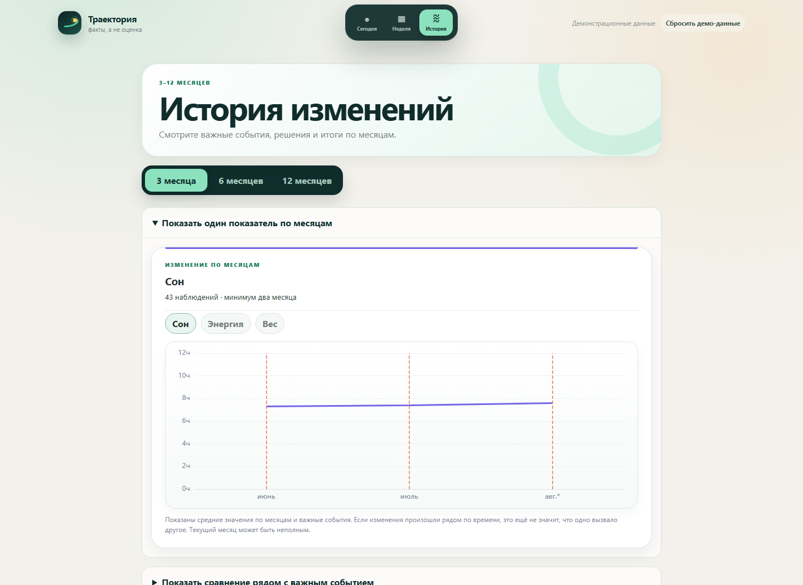

# Trajectory

Trajectory helps people record a few facts about each day, review a week, see changes over time, and choose a useful next step. It does not score days or guess why something happened.


**Vue 3 · TypeScript · Pinia · Dexie · ECharts · PWA**

The main flow is small: record what mattered today, review a completed week, look at longer-term changes, and choose what to do next. Every field is optional. Missing entries stay missing instead of being replaced with guesses.

## Why Trajectory

It is easy to remember a whole week by its last or strongest feeling. Trajectory places daily notes, completed work, important events, and wellbeing next to each other. Every comparison shows how many records it uses, and the app never presents a coincidence as a proven cause.



## How it works

- **Today:** record sleep, energy, daily conditions, actions, life areas, and one short note. Every field is optional.
- **Week:** see the recorded days, completed work, important events, unusual days, and one decision for the next week.
- **History:** follow important events and decisions, view monthly values, and compare equal periods before and after an event.

## Engineering highlights

- **Local data.** Pinia manages application state, while Dexie keeps edits in IndexedDB across reloads.
- **Clear code boundaries.** Import rules keep data normalization, application flows, Vue components, calculations, and storage separate.
- **Calculations separate from charts.** Plain TypeScript modules build summaries and comparisons; Vue and ECharts only display them.
- **Missing data stays missing.** Calculations keep gaps, record counts, incomplete periods, and unusual days visible.
- **Offline-ready PWA.** The app supports local data, service-worker updates, route-level loading, and recovery after an outdated deployment.
- **Repeatable demo data.** The app, automated tests, and screenshots use the same fixed data generator.

## Product walkthrough

### Today

The mobile-first entry keeps the current week visible while allowing the user to record only the observations that matter that day.

<p align="center">
  
</p>

### Week

The weekly view places recorded days, completed work, important events, and a few careful observations on one screen.



### Next decision

The review shows the previous decision and what happened afterwards. The user can then save one next step and an optional “if–then” plan.



### History

History shows monthly values together with the number of records used. It marks incomplete periods and does not claim that an event caused a change.



## Architecture

```text
Vue views and components
          ↓
Application features
          ↓
Domain model and analytics
          ↓
Dexie local persistence
```

See [the architecture overview](docs/architecture.md) for module responsibilities and the public repository boundary.

## Explore the code

- [Data normalization](src/model/normalization.ts) keeps old records compatible and preserves missing values.
- [Analytics modules](src/features/analytics) keep calculations separate from the interface.
- [Dexie schema](src/db.ts) and [application store](src/stores/app.ts) show how local data is stored.
- [Daily-entry feature](src/features/daily-entry) contains the flow for short daily records.
- [Demo bootstrap](src/demo/bootstrap.ts) and [data generator](scripts/generate-demo-data.mjs) create the same validated starting data every time.

## Local data and reset

On first launch, the app adds fixed demo data to an empty IndexedDB database. Later edits stay on the device, and **Сбросить демо-данные** restores the original demo. No account or server is required.

## Testing

The test suite covers daily records, calculations, versioned import, demo data, key Vue components, local storage, and navigation.

```powershell
npm.cmd run lint
npm.cmd run format:check
npm.cmd test
npm.cmd run build
npm.cmd run test:e2e
```

## Run locally

Requirements: Node.js 22 and npm.

```powershell
npm.cmd ci
npm.cmd run dev
```

The synthetic data asset is generated automatically before development, production builds, and Playwright runs.

## Public and production editions

This repository contains an interactive public showcase of Trajectory. It presents the three core local-first scenarios — Today, Week, and History — while production authentication, cloud synchronization, the monthly review, journals, settings, backend infrastructure, private data, internal documentation, and private development history remain outside this repository.
